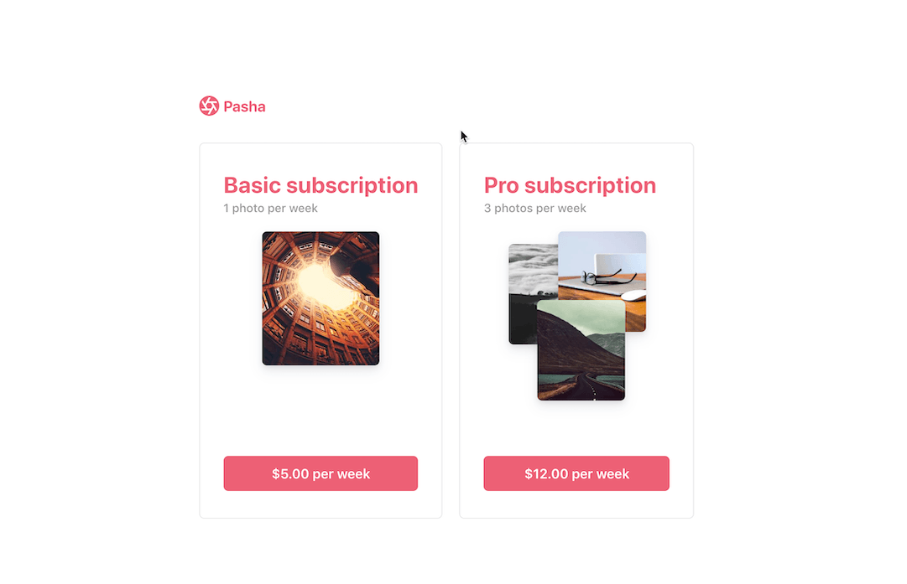

# Using Checkout for subscriptions

[Checkout](https://stripe.com/docs/payments/checkout) is a pre-built payment page that lets you accept cards and Apple Pay. [Billing](https://stripe.com/docs/billing) is a suite of APIs that lets you model complex subscription plans. You can combine the two products to get a subscription payment page up and running without the need of a server. 

When your customer is ready to pay, use [Stripe.js](https://stripe.com/docs/js) with the ID of your [Price](https://stripe.com/docs/api/prices) to redirect them to your Checkout page.



**Demo**

See the sample of the `client-and-server/` integration [live](https://4iupj.sse.codesandbox.io/) or [fork](https://codesandbox.io/s/stripe-sample-checkout-single-subscription-4iupj) the Node implementation on CodeSandbox.

The demo is running in test mode -- use `4242424242424242` as a test card number with any CVC + future expiration date.

Use the `4000000000003220` test card number to trigger a 3D Secure challenge flow.

Read more about testing on Stripe at https://stripe.com/docs/testing.

**Features:**

- Localization in 14 different languages 🌍
- Built-in Apple Pay support 🍎
- Built-in dynamic 3D Secure (ready for SCA) 🔔
- Plans to support more payment methods 🔮

For more features see the [Checkout documentation](https://stripe.com/docs/payments/checkout/subscriptions).

There are two integrations: [client-only](./client-only) and [client-and-server](./client-and-server). The client-and-server integration uses the [Checkout Sessions API](https://stripe.com/docs/api/checkout/sessions) for additional functionality.

<!-- prettier-ignore -->
|     | client-only | client-and-server
:--- | :---: | :---:
🔨 **Prebuilt checkout page.** Create a payment page that is customizable with your business' name and logo. | ✅  | ✅ |
🖥️ **Define prices in Dashboard or via API.** Create a price with either the Stripe Dashboard or API. | ✅  | ✅ |
🔢 **Start subscription for an existing Customer.** Use [Customers](https://stripe.com/docs/api/customers) to keep track of additional customer data.  | ❌  | ✅ |

## How to run locally

There are two integrations: `client-only` and `client-and-server`. The following are instructions on how to run the `client-and-server` integration: 

This sample includes 5 server implementations in Node, Ruby, Python, Java, and PHP.

Follow the steps below to run locally.

**[Client-only] 0. Enable Checkout in the Dashboard**

If you plan on using the client-only integration, go to your [account settings](https://dashboard.stripe.com/account/checkout/settings) in the Dashboard and enable Checkout.


**1. Clone and configure the sample**

The Stripe CLI is the fastest way to clone and configure a sample to run locally. 

**Using the Stripe CLI**

If you haven't already installed the CLI, follow the [installation steps](https://github.com/stripe/stripe-cli#installation) in the project README. The CLI is useful for cloning samples and locally testing webhooks and Stripe integrations.

In your terminal shell, run the Stripe CLI command to clone the sample:

```
stripe samples create checkout-single-subscription
```

The CLI will walk you through picking your integration type, server and client languages, and configuring your .env config file with your Stripe API keys. 

**Installing and cloning manually**

If you do not want to use the Stripe CLI, you can manually clone and configure the sample yourself:

```
git clone https://github.com/stripe-samples/checkout-single-subscription
```

Copy the .env.example file into a file named .env in the folder of the server you want to use. For example:

```
cp .env.example client-and-server/server/node/.env
```

You will need a Stripe account in order to run the demo. Once you set up your account, go to the Stripe [developer dashboard](https://stripe.com/docs/development#api-keys) to find your API keys.

```
STRIPE_PUBLISHABLE_KEY=<replace-with-your-publishable-key>
STRIPE_SECRET_KEY=<replace-with-your-secret-key>
```

The other environment variables are configurable:

`STATIC_DIR` tells the server where to the client files are located and does not need to be modified unless you move the server files.

`BASIC_PRICE_ID` requires a Price ID for a "basic" subscription.

`PRO_PRICE_ID` requires a Price ID for a "pro" subscription.

`DOMAIN` is the domain of your website, where Checkout will redirect back to after the customer completes the payment on the Checkout page. 

**2. Create Products and Prices on Stripe** 

This sample requires two [Price](https://stripe.com/docs/api/prices/object) IDs to create the Checkout page. Products and Prices are objects on Stripe that let you model a subscription. 

You can create Products and Prices [in the dashboard](https://dashboard.stripe.com/products) or via [the API](https://stripe.com/docs/api/prices/create). Create two recurring Prices to run this sample. 

**3. Follow the server instructions on how to run:**

Pick the server language you want and follow the instructions in the server folder README on how to run.

For example, if you want to run the Node server:

```
cd client-and-server/server/node # there's a README in this folder with instructions
npm install
npm start
```

**4. [Optional] Run a webhook locally:**

You can use the Stripe CLI to easily spin up a local webhook.

First [install the CLI](https://stripe.com/docs/stripe-cli) and [link your Stripe account](https://stripe.com/docs/stripe-cli#link-account).

```
stripe listen --forward-to localhost:4242/webhook
```

The CLI will print a webhook secret key to the console. Set `STRIPE_WEBHOOK_SECRET` to this value in your .env file.

You should see events logged in the console where the CLI is running.

When you are ready to create a live webhook endpoint, follow our guide in the docs on [configuring a webhook endpoint in the dashboard](https://stripe.com/docs/webhooks/setup#configure-webhook-settings). 


## FAQ

Q: Why did you pick these frameworks?

A: We chose the most minimal framework to convey the key Stripe calls and concepts you need to understand. These demos are meant as an educational tool that helps you roadmap how to integrate Stripe within your own system independent of the framework.

Q: Can you show me how to build X?

A: We are always looking for new sample ideas, please email dev-samples@stripe.com with your suggestion!

Q: What happened to Plans and SKUs?

A: Plans and SKUs were old ways to model recurring and one-off prices. We created the Prices API to unify the two concepts and make it easier to reason about your pricing catalog. You can still pass old Plan and SKU IDs to Checkout -- to learn more read [our docs](https://stripe.com/docs/payments/checkout/migrating-prices) but know that you do not need to migrate any of your existing SKUs and Plans.

## Author(s)

[@adreyfus-stripe](https://twitter.com/adrind)
